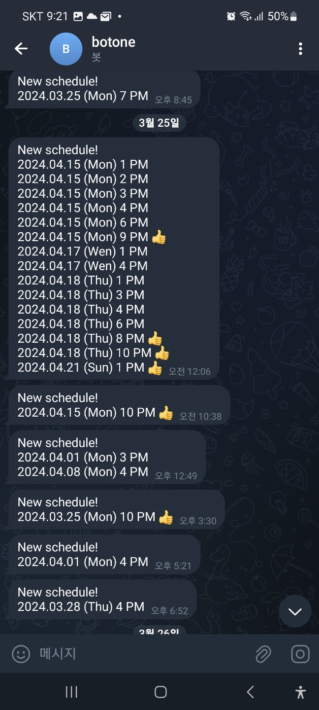

# Notifier

레슨 예약 비었을 떄 개인 telegram 으로 메세지를 보내주는 서비스. 10분 주기로 확인함

## 실행

1. `.env.example` 복사하여 `.env`로 설정
2. `.env`의 WIPI_로 시작하는 환경변수에 서버 url 및 개인 토큰, 학원 지점 id, 선생님 id, 본인 id 설정
3. `.env`의 BOT_TOKEN 및 CHAT_ID에 텔레그램 봇 토큰 및 개인 채널 id 입력
4. `npm install && npm run start`

선호 시간대 - 현재 8시, 9시, 10시로 설정 - [./util.mjs](./util.mjs) 에서 설정

## 테스트

`npm test` 를 통해 테스트
